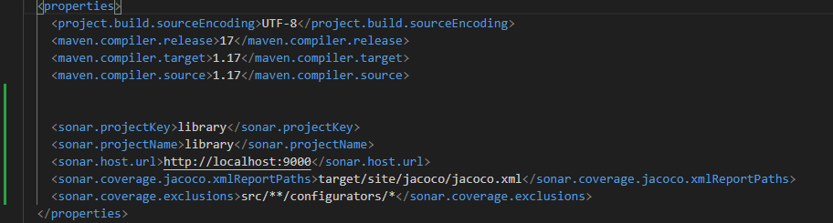
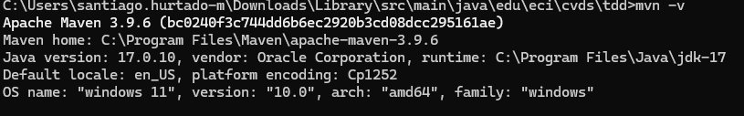
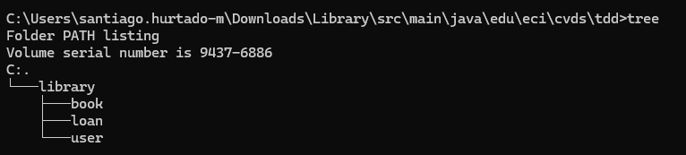
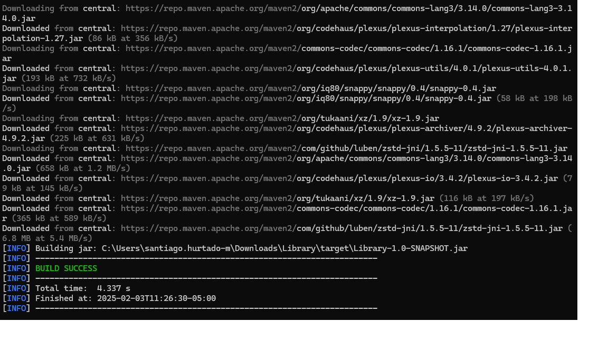

# LABORATORIO 3 - TDD
TALLER 3
Testing - TDD
PRE-RREQUISITOS
Java OpenJDK Runtime Environment: 17.x.x
Apache Maven: 3.9.x
JUnit: 5.x.x
Docker

## OBJETIVOS
Como hacer pruebas unitarias.
Utilizar anotaciones @Test del framework JUnit
Aplicar TDD.
## DESCRIPCIÓN PROYECTO
El proyecto consiste en un sistema de gestión de bibliotecas, donde hay clases que representan Libro, Usuario, Prestamo, y Biblioteca. Los usuarios pueden tomar prestados libros de la biblioteca, y la Biblioteca se encarga de gestionar los préstamos, asegurarse de que los libros estén disponibles, y mantener un registro de los libros prestados.

## CREAR PROYECTO CON MAVEN

## AGREGAR DEPENDENCIA JUNIT5

Buscar en maven central la dependencia de JUnit5 en su versión más reciente.

Edite el archivo pom.xml del proyecto para agregar la dependencia.

Verifique que la versión de java sea la 17

## AGREGAR ESQUELETO DEL PROYECTO
Cree los siguientes paquetes dentro de edu.eci.cvds.tdd

library
book
loan
user

## AGREGAR CLASES

Para validar que la estructura del proyecto está bien se debe compilar usando el comando package.

## PRUEBAS UNITARIAS Y TDD

Para poder implementar los métodos addBook, loanABook y returnLoan de la clase Library vamos a aplicar la técnica de TDD, por cada caso de prueba se debe hacer un commit, cada commit debe tener la prueba nueva y la implementación para que la prueba del commit funcione. Las pruebas anteriormente implementadas deben continuar funcionando. Como están trabajando en parejas es necesario trabajar en ramas independientes y utilizar Pull Request para mezclar los cambios.

## CREAR CLASE DE PRUEBA

Es necesario crear la clase de prueba para edu.eci.cvds.tdd.Library, la clase debe seguir los estándares de nombres estudiados en clase.

Para pensar en los casos de pruebas lean detenidamente el javadoc de los métodos para reconocer las clases de equivalencia, basados en las clases de equivalencia se debe crear una prueba la cual debe fallar y posteriormente implementar el código necesario para que funcione, este proceso se debe repetir hasta cumplir con la especificación definida en el javadoc.

## COBERTURA

Agregar la dependencia de jacoco, utilizar la última versión disponible en maven central.
Para usar Jacoco es necesario agregar la siguiente sección en el pom.xml